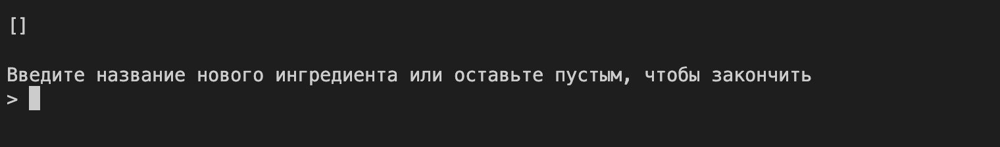

# Гайд по MVC

- [Что означает MVC?](#что-означает-mvc)
- [Делаем приложение "Бургерная" на MVC](#делаем-приложение-бургерная-на-mvc)
  - [Модель данных](#модель-данных)
  - [Представление](#представление)
  - [Контроллер](#контроллер)
  - [Подписываем представление на обновления модели](#подписываем-представление-на-обновления-модели)
  - [Связываем всё вместе и запускаем](#связываем-всё-вместе-и-запускаем)
- [Ещё раз, как это работает?](#ещё-раз-как-это-работает)

Для того чтобы код нашего приложения было легко читать и поддерживать, а также для того чтобы минимизировать количество ошибок мы применяем различные архитектурные паттерны. Один из самых известных - MVC (Model View Controller). В этом гайде мы расскажем тебе, что представляет из себя этот паттерн и покажем его реализацию на примере простого приложения.

## Что означает MVC?


Паттерн MVC используется, чтобы отделить логику и данные приложения от его визуального представления. Вот за что ответчает каждая из частей паттерна:

**Model** - Модель данных. Отвечает за `хранение, получение и изменение данных`, а также за бизнес-логику (логику работы с данными). Модель может обращаться к базе данных или отправлять запросы на сервер. Модель не имеет доступа ни к представлению (View) ни к контроллеру. Однако, модель уведомляет представление об изменениях, которые в ней происходят с помощью EventEmitter'а (о том, что это такое - чуть позже).

**View** - Визуальное представление приложения. Отвечает за `отображение приложения на экране пользователя`, а также за `считывание пользовательского ввода` (ввод текста в поле формы или командную строку, клик мышкой по кнопке, и т.д.). Представление строится на основе модели, а также обновляет отображение на экране (перерендеривается) если в модели происходят изменения. Представление не может напрямую изменять модель, вместо этого оно уведомляет контроллер когда пользователь совершает какие-то действия с помощью EventEmitter'а.

**Controller** - Контроллер `подписывается на события представления`, которые генерируются когда пользователь совершает какие-то действия (пользовательский ввод). Когда происходит такое событие контроллер `решает какой метод модели следует вызывать, чтобы данные приложение изменились`.

Это была сухая теория. Теперь, чтобы стало понятнее перейдём к практике.

## Делаем приложение "Бургерная" на MVC

Нам нужно сделать простое консольное приложение, которое позволит создавать бургеры с разными начинками. Когда пользователь запускает приложение он должен увидеть приглашение к тому чтобы сделать первый бургер:


После того как пользователь нажимает любую клавишу он попадает на страницу создания бургера.



Здесь он может вводить новые ингридиенты, чтобы добавить их в бургер.


Процесс продолжается пока пользователь не нажмёт Enter при пустой строке ввода. Затем он перемещается на начальный экран где видит все созданные ранее бургеры.


Пример готового приложения смотри в папке `burgers-example`.

### Модель данных

Удобнее всего в начале реализовать модель данных приложения. Давай подумаем на основе каких данных будет отображаться наше приложение? Все данные будут приватными полями класса Model. Напомним, что приватное поле начинается с # и к нему можно обратиться только из методов класса, в котором оно определено. Также объявим методы, которые позволят изменять модель.

```javascript
// Model.js

class Model {
  // Страница, на которй в данный момент находится пользователь:
  // 'burgers' - стартовая страница, на которой отображаются все созданные бургеры
  // 'make-burger' - страница создания нового бургера
  #page = 'burgers';

  // Массив уже созданных бургеров. Каждый бургер в свою очередь будет представлять
  // из себя массив ингридиентов. То есть #burgers - это массив массивов.
  #burgers = [];

  // Бургер, который мы создаём в данный момент. Массив строк-ингридиентов.
  #currentBurger;

  // #page, #burgers, #currentBurger - приватные поля. Чтобы обращаться к ним из
  // других классов сделаем методы-геттеры.

  getPage() {
    return this.#page;
  }

  getCurrentBurger() {
    return this.#currentBurger;
  }

  getBurgers() {
    return this.#burgers;
  }

  // Перейти на страницу создания бургера
  startMakeBurger() {
    this.#page = 'make-burger';
    this.#currentBurger = [];
  }

  // Добавить новый ингридиент к текущему бургеру
  addIngridient(indgridient) {
    this.#currentBurger.push(indgridient);
  }

  // Закончить создание бургера и перейти на стартовую страницу
  stopMakeBurger() {
    if (this.#currentBurger.length) {
      this.#burgers.push(this.#currentBurger);
      this.#currentBurger = undefined;
    }
    this.#page = 'burgers';
  }
}

module.exports = Model;
```

### Представление

Теперь возьмёмся за представление. Оно должно отображать состояние нашей модели.

```javascript
// View.js

const readlineSync = require('readline-sync');

class View {
  #model;

  constructor(model) {
    this.#model = model;
  }

  // Отобразить текущую страницу
  render() {
    // Стираем с экрана весь предыдущий текст
    console.clear();

    // отображаем ту страницу, на которой мы сейчас находимся
    switch (this.#model.getPage()) {
      case 'burgers':
        return this.#renderBurgersPage();
      case 'make-burger':
        return this.#renderMakeBurgerPage();
      default:
        throw new Error('Wrong page');
    }
  }

  // Отобразить стартовую страницу
  #renderBurgersPage() {
    // Если ранее были созданы бургеры, отображаем их
    if (this.#model.getBurgers().length) {
      console.log('Бургеры:');
      this.#model.getBurgers().forEach(View.#printBurger);
      console.log();
    }

    readlineSync.question('Нажмите любую клавишу, чтобы сделать бургер…');
  }

  // Отобразить страницу создания бургера
  #renderMakeBurgerPage() {
    // Отображаем текущий бургер
    View.#printBurger(this.#model.getCurrentBurger());
    console.log();

    console.log('Введите название нового ингридиента или оставьте пустым, чтобы закончить');
    // считываем следующий ингридиент из командной строки
    const ingridient = readlineSync.question('> ');
  }

  static #printBurger(burger) {
    console.log(`[${burger.join(' | ')}]`);
  }
}

module.exports = View;
```

### Контроллер

Теперь нам нужно сделать так, чтобы модель изменялась когда пользователь совершает какое-то действие. Однако, представление не имеет права вызывать методы модели, вместо этого оно должно уведомить контроллер об изменениях, а контроллер в свою очередь изменит модель. Чтобы решить эту задачу используем стандартный класс EventEmitter. Он позволяет одному объекту генерировать события, а другому подписываться на эти события и реагировать на них каким-то образом.

Подумаем, какие действия совершает пользователь?

- На стартовом экране нажимает любую клавишу, чтобы перейти к странице создания бургера
- На экране создания бургера вводит название ингридиента и нажимает Enter
- Либо на том же экране нажимает Enter, оставляя строку пустой

Соответственно представление будет генерировать три события: makeBurger, addIngridient и stopMakeBurger.

Чтобы сгенерировать события на стороне представления унаследуем его от класса EventEmitter и вызовем унаследованный от EventEmitter метод emit в момент когда событие произошло.

```javascript
// View.js

const { EventEmitter } = require('events');
const readlineSync = require('readline-sync');

class View extends EventEmitter {
  // ...
  #model;

  constructor(model) {
    // вызываем конструктор родительского класса EventEmitter
    super();
    this.#model = model;
  }

  //...

  // Отобразить стартовую страницу
  #renderBurgersPage() {
    // Если ранее были созданы бургеры, отображаем их
    if (this.#model.getBurgers().length) {
      console.log('Бургеры:');
      this.#model.getBurgers().forEach(View.#printBurger);
      console.log();
    }

    readlineSync.question('Нажмите любую клавишу, чтобы сделать бургер…');

    // Клавиша нажата, генерируем событие
    this.emit('makeBurger');
  }

  // Отобразить страницу создания бургера
  #renderMakeBurgerPage() {
    // Отображаем текущий бургер
    View.#printBurger(this.#model.getCurrentBurger());
    console.log();

    console.log('Введите название нового ингридиента или оставьте пустым, чтобы закончить');
    // считываем следующий ингридиент из командной строки
    const ingridient = readlineSync.question('> ');

    // генерируем событие addIngridient если пользователь хочет добавить ингридиент
    // и stopMakeBurger если хочет закончить создание бургера
    if (ingridient) {
      this.emit('addIngridient', ingridient);
    } else {
      this.emit('stopMakeBurger');
    }
  }

  // ...
}
```

А теперь подпишемся на эти события на стороне контроллера

```javascript
// Controller.js

class Controller {
  #model;

  #view;

  constructor(model, view) {
    this.#model = model;
    this.#view = view;

    // Здесь подпишемся на события View и решим, что нужно делать с моделью при их возникновении
    // View наследует метод on от класса EventEmitter
    this.#view.on(
      // каждый раз когда View генерирует событие 'makeBurger'
      'makeBurger',
      // вызываем метод startMakeBurger модели
      () => this.#model.startMakeBurger()
    );
    this.#view.on('addIngridient', (ingridient) => this.#model.addIngridient(ingridient));
    this.#view.on('stopMakeBurger', () => this.#model.stopMakeBurger());
  }

  // Контроллер - главный класс, с его метода run начинается работа нашего приложения
  run() {
    // попросим View отобразить первоначальный экран
    this.#view.render();
  }
}

module.exports = Controller;
```

### Подписываем представление на обновления модели

Теперь когда пользователь совершает действия модель будет изменяться. Остаётся только сделать так чтобы представление обновлялось когда изменяется модель. Для этого также унаследуем модель от EventEmitter и будем генерировать событие `update` каждый раз когда любые данные меняются.

```javascript
// Model.js

const { EventEmitter } = require('events');

class Model extends EventEmitter {
  // ...

  // Перейти на страницу создания бургера
  startMakeBurger() {
    this.#page = 'make-burger';
    this.#currentBurger = [];
    this.emit('update');
  }

  // Добавить новый ингридиент к текущему бургеру
  addIngridient(indgridient) {
    this.#currentBurger.push(indgridient);
    this.emit('update');
  }

  // Закончить создание бургера и перейти на стартовую страницу
  stopMakeBurger() {
    if (this.#currentBurger.length) {
      this.#burgers.push(this.#currentBurger);
      this.#currentBurger = undefined;
    }
    this.#page = 'burgers';
    this.emit('update');
  }
}
```

И в конце концов подписываем представление на событие `update` модели.

```javascript
// View.js

const { EventEmitter } = require('events');
const readlineSync = require('readline-sync');

class View extends EventEmitter {
  #model;

  constructor(model) {
    // вызываем конструктор родительского класса EventEmitter
    super();
    this.#model = model;

    this.#model.on(
      // каждый раз когда данные меняются
      'update',
      // обновляем отображение (перерендериваем)
      () => this.render()
    );
  }

  // ...
}
```

### Связываем всё вместе и запускаем

```javascript
// runner.js

const Controller = require('./Controller');
const Model = require('./Model');
const View = require('./View');

const model = new Model();
const view = new View(model);
const controller = new Controller(model, view);

controller.run();
```

## Ещё раз, как это работает?

Наше приложение готово. Давай проследим как оно работает:

1. Сначала мы вызываем метод `run` контроллера.
2. Он вызывает метод `render` представления.
3. Метод `render` получает из модели текущую страницу приложения (это 'burgers') и вызывает метод `#renderBurgersPage`, чтобы отрисовать её.
4. Метод `#renderBurgersPage` отображает на экране приглашение создать новый бургер и генерирует событие 'makeBurger' когда пользователь нажимает любую клавишу.
5. Контроллер ловит это событие и вызывает метод `startMakeBurger` модели.
6. Метод `startMakeBurger` меняет страницу на 'make-burger', создаёт новый массив `#currentBurger` для нового бургера и генерирует событие 'update'
7. Представление ловит событие 'update' модели и показывает страницу создания бургера.
8. И т.д. (остальную логику работы приложения разбери самостоятельно).
